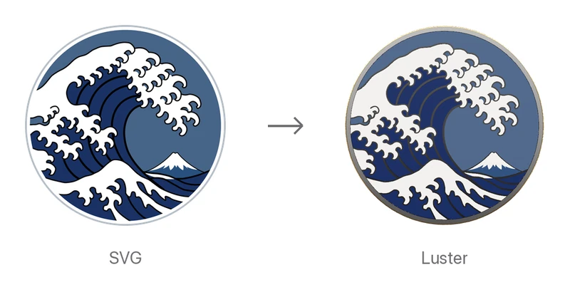

# Luster

Turns an SVG into a 3D gold enamel badge, and shows it lit and turning — or writes it
out as GLB.

<p align="center">
  <picture>
    <source media="(prefers-color-scheme: dark)" srcset="docs/images/hero-dark.webp">
    
  </picture>
</p>

Luster builds the whole object from the document's paths: the silhouette, the enamel
cells, the raised gold line work, the rolled edge, the sandblasted reverse. It ships no
3D model assets and no artwork.

The engine is Rust, shared by a Swift package, a Kotlin library and a Flutter package,
so the same document gives the same badge, to the byte, on every platform.

## Requirements

| Platform | Minimum |
| --- | --- |
| Apple | iOS 18 or macOS 15, Swift 6 |
| Android | Android 7 (API 24) |
| Flutter | Flutter 3.47.1, with Flutter GPU enabled ([see below](#flutter)) |

## Install

**Swift Package Manager**

```swift
.package(url: "https://github.com/famio/Luster.git", from: "0.1.0")
```

Two products: `Luster` (mint a badge, take a still) and `LusterUI` (views).

**Android** — Not on Maven Central yet. Until it is, build the library from a checkout
(see [CONTRIBUTING.md](CONTRIBUTING.md)).

**Flutter** — Not on pub.dev yet. Until it is, depend on the repository (building it
needs a Rust toolchain):

```yaml
dependencies:
  luster:
    git:
      url: https://github.com/famio/Luster.git
      path: flutter/luster
```

## Quick start

**SwiftUI**

```swift
import LusterUI

LusterView(source: .url(url))
```

**Jetpack Compose**

```kotlin
import dev.famio.luster.compose.LusterView

LusterView(
    source = LusterSource.url("https://example.com/badge.svg"),
    modifier = Modifier.size(280.dp),
)
```

**Flutter**

```dart
import 'package:luster/luster.dart';

LusterView(source: LusterSource.url(Uri.parse('https://example.com/badge.svg')))
```

Drag to turn the badge; a flick keeps it turning, unless the system asks for reduced
motion or `momentumEnabled` is false. Minting runs off the UI thread, and the previous
badge stays on screen while a new one is struck.

The view draws nothing behind the badge, so the background is yours: a colour, a
gradient, a photo, or nothing.

## Settings

Every platform has the same settings under the same names.

```swift
LusterView(source: .url(url),
           options: LusterOptions(metalLines: true),
           appearance: LusterAppearance(metal: .silver),
           onStateChange: { state in … })
```

| What | Swift | Kotlin | Dart |
| --- | --- | --- | --- |
| The document | `LusterSource.url(_:)` (a file or the web), `.data(_:)`, `.svg(_:)` | `LusterSource.url(…)`, `.bytes(…)`, `.svg(…)` | `LusterSource.url(…)`, `.bytes(…)`, `.svg(…)` |
| What to strike | `LusterOptions(metalLines:withoutHiddenFaces:)` | `LusterOptions(metalLines, withoutHiddenFaces)` | `LusterOptions(metalLines:, withoutHiddenFaces:)` |
| How to light it | `LusterAppearance(metal:lighting:)` | `LusterAppearance(metal, lighting)` | `LusterAppearance(metal:, lighting:)` |
| The metal | `.gold`, `.silver`, `.copper`, any `LusterColor` | `LusterColor.Gold`, `Silver`, `Copper`, … | `LusterColor.gold`, `silver`, `copper`, … |
| The lighting | `.showcase`, `.off` | `SHOWCASE`, `OFF` | `showcase`, `off` |
| What it is doing | `LusterState` `.idle / .minting / .ready / .failed` | `LusterState.Idle / Minting / Ready / Failed` | `LusterIdle / LusterMinting / LusterReady / LusterFailed` |

- **`metalLines`** — By default the lines the document strokes stand as metal walls
  plated in their own stroke colours. `metalLines` leaves them in bare metal instead:
  gold walls round coloured enamel.
- **`withoutHiddenFaces`** — Leaves out the faces no view can see. It costs more time
  than it saves on screen, so it suits GLB files made once and loaded many times.
- **`showcase`** lights the badge as a product photograph would; **`off`** shows its
  shape under plain lamps, with nothing that shines.

A different source or options mints again; a different appearance only re-lights and
re-plates.

## Without a view

```swift
let badge = try await LusterEngine.mint(.url(url), options: .init(metalLines: true))
let glb = await badge.glb(metal: .gold)                          // glTF binary
let still = try await LusterSnapshot.image(badge, pixelSize: 512)  // CGImage
```

```kotlin
val badge = Luster.mint(LusterSource.bytes(svg), LusterOptions(metalLines = true))
val glb = badge.glb(metal = LusterColor.Gold)
val still = LusterSnapshot.bitmap(context, badge, pixelSize = 512)  // Bitmap
```

```dart
final badge = await Luster.mint(LusterSource.bytes(bytes));
final glb = await badge.glb(metal: LusterColor.gold);
final still = await LusterSnapshot.image(badge, pixelSize: 512);    // ui.Image
```

- **Stills** look as the view does. A list or a grid wants stills rather than a live
  view per row. A still is transparent round the badge unless it is given a
  `background` colour.
- **GLB** is glTF 2.0 binary. The same badge writes the same bytes on every platform.
- **Caching** — recent badges are kept, keyed by the document's bytes and the options,
  so asking again is immediate, and asking for one already being struck waits for that
  mint. A badge's `designKey` names what it was struck from: equal keys mean the same
  badge.
- **Prewarming** — `LusterEngine.prewarm()` (Swift) or `Luster.prewarm()` (Android) at
  launch prepares the lighting ahead of the first badge; `Luster.init()` does the same
  in Flutter.
- **Cancelling** the task or coroutine stops a mint, unless someone else still wants the
  same badge.

### Errors

A mint that fails throws `LusterError` (Swift), a subclass of `LusterException`
(Kotlin), or a `LusterException` with a `kind` (Dart). The cases are the same on every
platform:

| Case | Why |
| --- | --- |
| `invalidSvg`, `inputTooComplex`, `nothingToMint` | The document |
| `tooLarge`, `unreadableSource` | Where it came from |
| `engineFailure` | A bug |

## From the web

`LusterSource.url` fetches with the loader in `LusterEngine.loader` (Swift) or
`Luster.loader` (Kotlin, Dart). Documents over 20 MB are refused. The default loaders
are `URLSession.shared`, which `URLCache` caches as the server's headers allow;
`HttpURLConnection`, which caches nothing unless the app installs an
`HttpResponseCache`; and `dart:io`'s `HttpClient`, which caches nothing. On Android the
app needs the `INTERNET` permission.

To share the cache an app already uses for images, set your own loader:

<details>
<summary>Nuke (Swift)</summary>

```swift
import Nuke

nonisolated struct NukeLoader: LusterLoader {
    var pipeline = ImagePipeline(configuration: .withDataCache)  // or .shared

    func data(for url: URL) async throws -> Data {
        try await pipeline.data(for: ImageRequest(url: url)).0
    }
}

LusterEngine.loader = NukeLoader()
```

</details>

<details>
<summary>SDWebImage (Swift)</summary>

SDWebImage's downloader throws away what it cannot decode as an image, and an SVG is
one of those unless an SVG coder is installed, so its cache is used directly:

```swift
import SDWebImage

nonisolated struct SDWebImageLoader: LusterLoader {
    // Off the caller's actor: the disk cache is read synchronously.
    @concurrent func data(for url: URL) async throws -> Data {
        let cache = SDImageCache.shared, key = url.absoluteString
        if let data = cache.diskImageData(forKey: key) { return data }
        let (data, response) = try await URLSession.shared.data(from: url)
        if let http = response as? HTTPURLResponse, !(200..<300).contains(http.statusCode) {
            throw URLError(.badServerResponse)
        }
        cache.storeImageData(toDisk: data, forKey: key)
        return data
    }
}

LusterEngine.loader = SDWebImageLoader()
```

</details>

<details>
<summary>OkHttp (Kotlin)</summary>

```kotlin
class OkHttpLoader(private val client: OkHttpClient) : LusterLoader {
    override suspend fun load(url: String): ByteArray = runInterruptible(Dispatchers.IO) {
        client.newCall(Request.Builder().url(url).build()).execute().use { response ->
            if (!response.isSuccessful) throw IOException("HTTP ${response.code}")
            response.body!!.bytes()
        }
    }
}

Luster.loader = OkHttpLoader(
    OkHttpClient.Builder().cache(Cache(File(context.cacheDir, "luster"), 10L shl 20)).build()
)
```

</details>

<details>
<summary>flutter_cache_manager (Dart)</summary>

```dart
import 'package:flutter_cache_manager/flutter_cache_manager.dart';

Luster.loader = (url) async =>
    (await DefaultCacheManager().getSingleFile(url.toString())).readAsBytes();
```

</details>

## Platform notes

### Apple

`LusterUIView` (UIKit) and `LusterNSView` (AppKit) are plain views with the same
settings as properties, so they go anywhere a view can: a stack, a cell, a view
controller's own view.

```swift
let view = LusterUIView(source: .url(url))
view.options = LusterOptions(metalLines: true)
view.badgeAppearance = LusterAppearance(metal: .silver)
```

### Android

`dev.famio.luster.LusterView` is a `TextureView` for the View system; the composable is
`dev.famio.luster.compose.LusterView` in the `luster-compose` module. A drag on either one
turns the badge, inside a scrolling list or a pager too. Call `release()` when you are
done with the View; the composable frees itself when it leaves the composition.

```kotlin
val view = LusterView(context)
view.source = LusterSource.url("https://example.com/badge.svg")
view.options = LusterOptions(metalLines = true)
view.appearance = LusterAppearance(metal = LusterColor.Silver)
```

### Flutter

The widget draws with Flutter GPU, which the app has to enable, and on Android Flutter
GPU needs the Vulkan backend: try it on a device, because the standard emulator images
run OpenGL ES. Until prebuilt engines are published, building the app needs a Rust
toolchain. See [the package's README](flutter/luster/README.md) for the setup.

## Examples

| | |
| --- | --- |
| `Examples/LusterDemo` | The iOS demo: open an SVG, pick the lines, the metal and the light, save a GLB. Tabs switch between the SwiftUI and the UIKit view. `xcodegen generate` first |
| `android/sample` | The Android demo, the same app in Compose and with Views. `cd android && ./gradlew :sample:installDebug` |
| `flutter/luster/example` | The Flutter demo. `cd flutter/luster/example && fvm flutter run` |
| `Apps/LusterMac` | A macOS app: drop an SVG, pick the metal, the lighting and the lines, export a GLB. `Apps/LusterMac/make-app.sh` |

[How it works](docs/how-it-works.md) describes how a badge is built and lit.
[CONTRIBUTING.md](CONTRIBUTING.md) covers building from a checkout, testing and
releasing.

## Acknowledgements

Luster stands on [Minted](https://github.com/haplollc/Minted) by Haplo LLC, which turns
any SVG into a physically lit 3D gold medallion for SwiftUI on iOS.

The idea at the heart of this project is theirs: generate the entire coin from 2D
paths and ship no model files. So is the construction — the gold body, the enamel
cells, the raised wire, the die-struck orange-peel reverse and the studio reflections
that make the metal read as metal. Luster began as a macOS port of that work and grew
from there into full-document SVG reading with colours, the badge and cloisonné
finishes, GLB export, and an engine shared across platforms.

Thank you to the Minted authors for building it and for sharing it openly. Minted is
released under the MIT License, © 2026 Haplo LLC; its notice is reproduced in
[THIRD_PARTY_NOTICES.md](THIRD_PARTY_NOTICES.md).

## License

Luster is released under the [MIT License](LICENSE).
